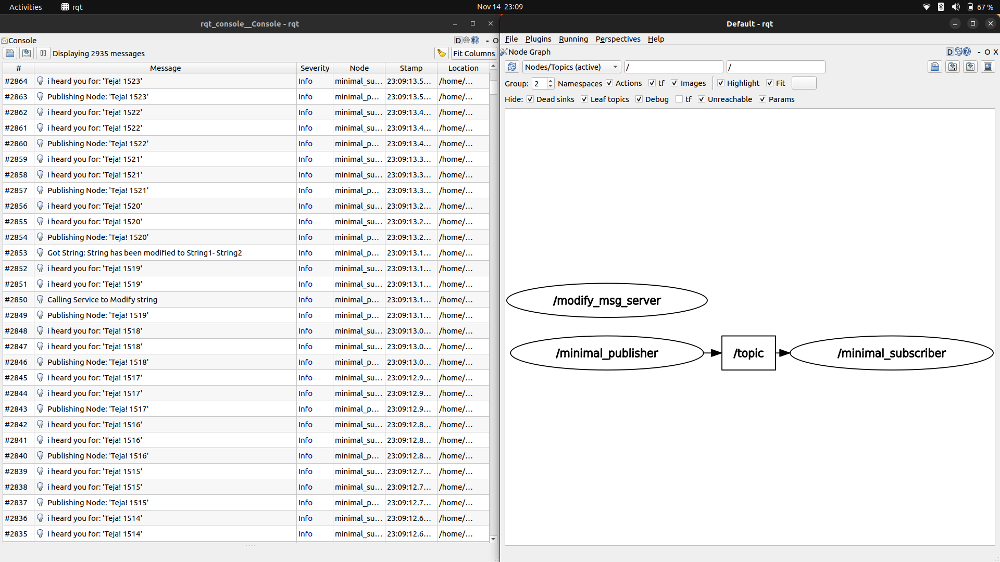
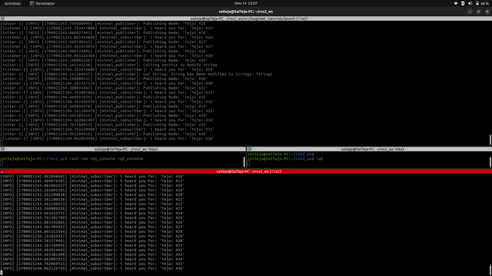

# ROS2 CPP Publisher and Subscriber Tutorial

## To-Do

- Modify the Publisher Node to Publish a Custom String Message
- Follow Google C++ Style Guide in the Tutorial Code
- Run Cpplint on ROS Package Files and Save Output
- Run Cppcheck on ROS Package Files and Save Output

## Prerequisites

- Ubuntu 22.04
- ROS 2 Humble
- rclcpp
- stdmsgs

## Build and Run nodes by terminal commands 

1. **Clone Package**

   ```sh
   mkdir -p ~/ros2_ws/src
   cd ~/ros2_ws/src 
   git clone https://github.com/saiteja12-g/beginner_tutorials.git
   ```

2. **Build the Package**

    Navigate to your root ROS 2 workspace and build the package using colcon.

    ```sh
    colcon build --packages-select beginner_tutorials
    ```

3. **Source the Workspace**
    Source the ROS 2 workspace to set the environment for the package.

    ```sh
    source install/setup.bash
    ```

4. **Run the Publisher Node(talker)**
    You can now run the custom string publisher node.

    ```sh
    ros2 run beginner_tutorials talker
    ```

5. **Run the Subscriber Node(listener)**
    Open a new terminal, navigate to ros2 workspace and run the subscriber node.

    ```sh
    source install/setup.bash
    ros2 run beginner_tutorials listener
    ```
6. **Launch server**
    Open a new terminal, navigate to ros2 workspace and run the subscriber node.

        ```sh
        source install/setup.bash
        ros2 run beginner_tutorials server
        ```

## Build and Run nodes by launch file
Close all the terminal and reopen new terminal

```sh
cd ~/ros2_ws
source install/setup.bash

cd src/beginner_tutorials/launch
ros2 launch launch.yaml frequency:=20.0
```

## Change `frequency` parameter 
```sh
cd ~/ros2_ws
source install/setup.bash

ros2 param set \minimal_publisher freq 5.0
```
## Results 
Terminal output


Logging info and RQT node graph

